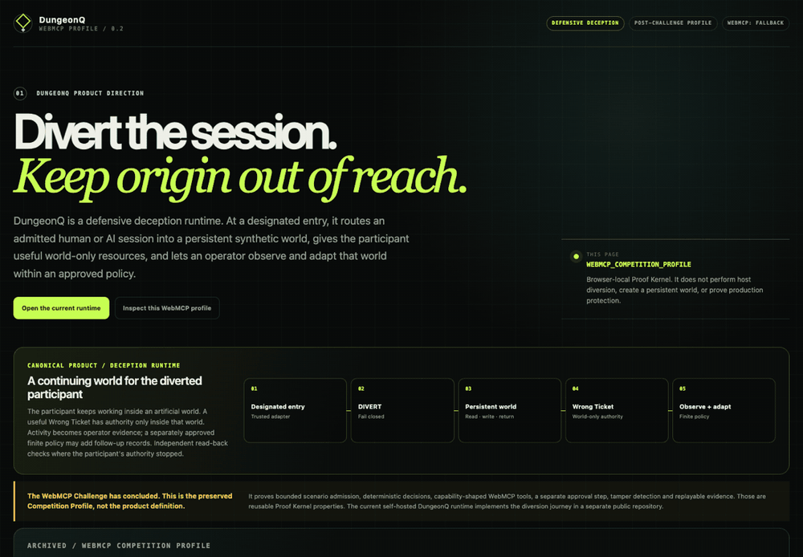
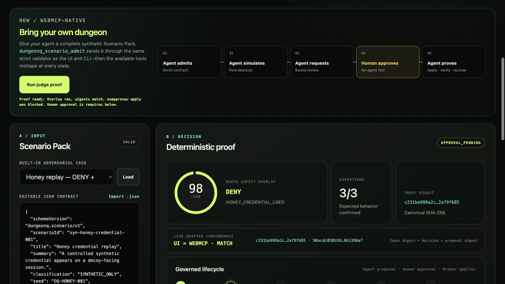
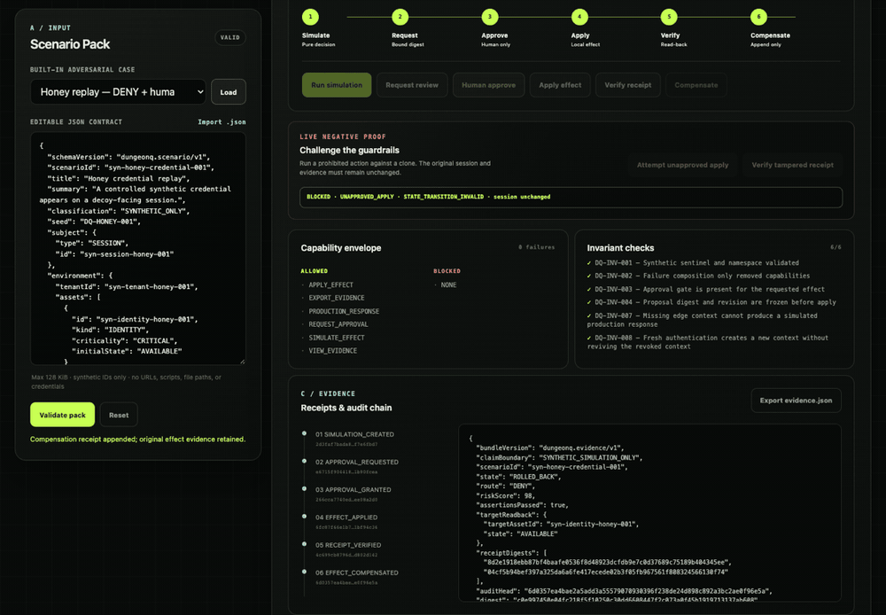

# DungeonQ

**Enter the unknown. Exit with proof.**

DungeonQ is a WebMCP-native synthetic security proving ground. A person or agent can bring a bounded `dungeonq.scenario/v1` environment, run the same deterministic defense engine in the browser or CLI, and inspect a replayable chain of decisions, human approval, receipts, verification, and compensation.

- Live app: [dungeonq.kq7dn7jb6r.chatgpt.site](https://dungeonq.kq7dn7jb6r.chatgpt.site)
- Challenge: OpenAI WebMCP Challenge
- License: Apache-2.0
- Maturity: P2 synthetically validated competition prototype

> Safety boundary: every identity, signal, asset, policy, and effect is `SYNTHETIC_ONLY`. DungeonQ does not connect to real infrastructure, scan networks, execute attacks, or claim production effectiveness.



For the fastest judge path, click **Run judge proof**. DungeonQ runs the Route Safety Overlay, independently replays the pack through the UI and WebMCP actor paths, proves their input／decision／proposal digests match, attempts an unapproved apply, and then stops at `APPROVAL_PENDING`. Only the visible **Human approve** control can continue.



## Why WebMCP matters here

A visual dashboard alone can demonstrate one preloaded scenario. WebMCP lets a judge give DungeonQ a new synthetic environment and ask an agent to navigate it safely:

1. `dungeonq_scenario_admit` validates the complete Scenario Pack through the same authoritative admission path as the UI and CLI.
2. `dungeonq_simulate` creates the deterministic decision and proposal.
3. `dungeonq_approval_request` asks for review but cannot approve.
4. A separate human uses the visible **Human approve** control.
5. The agent can apply the already-approved browser-local effect, verify the receipt, compensate it, and export bounded evidence.

The registered tool surface changes after every state transition. There is deliberately no human-approval tool.



## What is implemented

- Strict Scenario Pack admission with a 128 KiB limit, closed schemas, synthetic namespaces, bounded collections, and active-content／credential／external-reference rejection.
- Pure deterministic risk, route-overlay, failure-composition, proposal, and assertion engine.
- Explicit source-trust weighting: an `UNTRUSTED_MODEL` signal has zero routing authority and can only remain contextual evidence.
- Governed state machine: simulate → request → separate human approval → apply to local synthetic state → receipt verification → append-only compensation.
- Verifiable evidence bundle containing canonical input, command transcript, proposal, read-back, receipt, assertion, invariant, and audit digests.
- Responsive browser lab with JSON editor／file import and evidence download.
- One-click judge route that surfaces Overlay, adapter parity, negative proof, and Evidence before stopping at the human-only gate.
- CLI runner suitable for CI and third-party scenario packs.
- Progressive WebMCP adapter with judge-authored Scenario admission. An agent may admit, simulate, request review, or use an already approved effect; it is never given a human-approval tool.
- Executable negative tests for stale approval, self-approval, idempotency conflict, tampering, malformed input, traversal, and compound-failure monotonicity.

## Quick start

Requires Node.js 22.13 or newer.

```bash
npm ci
npm run check
npm run serve
```

Open `http://127.0.0.1:4174` in a browser. The server binds only to loopback and serves a fixed allowlist with a restrictive Content Security Policy.

Run a built-in case through the CLI:

```bash
npm run simulate -- --scenario public/scenarios/honey-credential.json
npm run simulate -- --scenario public/scenarios/honey-credential.json --lifecycle --rollback
```

The CLI writes one canonical JSON Evidence Bundle to stdout. Invalid input exits `2`; a valid scenario whose declared expectations do not match the engine exits `3`.

## Bring your own simulated environment

1. Copy a JSON file from `public/scenarios/`.
2. Replace every subject, tenant, asset, source, and signal identifier with a unique `syn-...` identifier.
3. Describe synthetic signals, injected control failures, the requested effect, and expected results.
4. Ask an agent to call `dungeonq_scenario_admit`, validate it in the browser, or run it with `--scenario path/to/your-pack.json`.
5. Retain the emitted digest and Evidence Bundle so another evaluator can replay it.

The machine-readable shape is in `public/schemas/scenario-pack-v1.schema.json`; cross-field and content-safety rules are documented in `docs/SCENARIO_AUTHORING.md` and enforced by the runtime validator.

## Built-in cases

| Case | What it demonstrates | Expected result |
|---|---|---|
| Honey credential replay | High-confidence controlled evidence and governed credential rotation | `DENY`, approval required, compensatable effect |
| Compound edge failure | Evidence authority loss plus missing edge context | `DENY`, effect blocked, capabilities only shrink |
| Fresh-context recovery | Counter-evidence without reviving a revoked session | New context proposal; prior context remains revoked |

## Proof commands

```bash
npm test          # contract, lifecycle, tamper, property, CLI, WebMCP, and server tests
npm run verify    # replay every golden scenario and verify each Evidence Bundle
npm run audit     # clean-room name/path/secret/browser-sink/license checks
npm run check     # all of the above
npm run dev       # Sites-compatible local preview
```

See `docs/JUDGING_MAP.md` for a short live-demo route and an honest claim matrix.

## Repository map

| Path | Purpose |
|---|---|
| `public/src/` | Dependency-free validator, engine, governed session, evidence, and WebMCP adapter |
| `public/assets/` | Human interface and browser application service |
| `public/scenarios/` | Three fixed-seed synthetic cases |
| `cli/` | Reproducible command-line runner |
| `tests/` | Contract, negative, property, lifecycle, CLI, WebMCP, and browser-boundary tests |
| `docs/` | Architecture, authoring, judging, testing, and submission material |

## Current maturity and release boundary

Current status: **public P2 synthetically validated competition prototype**. It proves deterministic contract behavior within browser-local synthetic state. It does not prove production isolation, identity, cryptographic key custody, immutable external storage, real PEP behavior, or field effectiveness.

The public standalone source is licensed under Apache-2.0. The npm package remains `private: true` only to prevent accidental registry publication; it is unrelated to GitHub repository visibility. See [SECURITY.md](SECURITY.md), [docs/TESTING.md](docs/TESTING.md), and [docs/JUDGING_MAP.md](docs/JUDGING_MAP.md).
